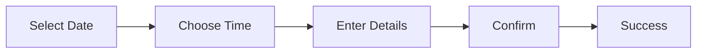
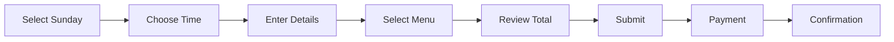

# Booking System Documentation

## Overview
Complete documentation for The Anchor's table and event booking systems, including regular bookings, Sunday lunch prepayment, and special event ticketing.

## Table of Contents
1. [System Architecture](#system-architecture)
2. [Booking Types](#booking-types)
3. [Implementation Details](#implementation-details)
4. [Payment Integration](#payment-integration)
5. [User Flow](#user-flow)
6. [Tracking & Analytics](#tracking--analytics)
7. [Known Issues & Solutions](#known-issues--solutions)

## System Architecture

### Components Overview
```
┌──────────────┐     ┌──────────────┐     ┌──────────────┐
│ BookingWizard│────▶│ API Routes   │────▶│ OrangeJelly  │
│  Component   │◀────│   (Proxy)    │◀────│ Management   │
└──────────────┘     └──────────────┘     └──────────────┘
       │                    │                     │
       ▼                    ▼                     ▼
  React State         Validation            Booking DB
   Management          & Security          & Payment
```

### File Structure
```
app/
├── book-table/
│   ├── page.tsx                 # Main booking page
│   └── BookingWizard.tsx        # Booking flow component
├── api/
│   ├── bookings/
│   │   ├── create/route.ts      # Create booking
│   │   ├── availability/route.ts # Check availability
│   │   ├── initiate/route.ts    # Event booking start
│   │   ├── verify-otp/route.ts  # OTP verification
│   │   └── submit/route.ts      # Final submission
│   └── menu/
│       └── sunday-lunch/route.ts # Sunday menu
components/
├── features/
│   ├── EventBookingCard.tsx     # Event display
│   └── BookingConfirmation.tsx  # Success state
└── ui/
    └── calendar.tsx             # Date picker
```

## Booking Types

### 1. Regular Table Booking
- **When**: Any day except Sunday lunch
- **Payment**: Not required
- **Confirmation**: Immediate

### 2. Sunday Lunch Booking
- **When**: Sundays 12:00-16:00
- **Payment**: Required (advance payment)
- **Menu Selection**: Required
- **Special Rules**: 
  - Must select menu items for all guests
  - Payment link generated after submission
  - Booking not confirmed until paid

### 3. Event Booking
- **Types**: Drag shows, quiz nights, special events
- **Payment**: Varies by event
- **Process**: OTP verification required
- **Tickets**: Multiple ticket types supported

## Implementation Details

### Booking Wizard Component
```typescript
// Main booking flow with multi-step form
export function BookingWizard() {
  const [step, setStep] = useState(1)
  const [bookingData, setBookingData] = useState<BookingData>({
    date: null,
    time: '',
    partySize: 2,
    customerDetails: {
      name: '',
      phone: '',
      email: ''
    },
    specialRequests: '',
    menuSelections: [] // For Sunday lunch
  })

  // Step 1: Date & Party Size
  // Step 2: Time Selection  
  // Step 3: Customer Details
  // Step 4: Menu Selection (Sunday only)
  // Step 5: Confirmation
}
```

### API Integration
```typescript
// app/api/bookings/create/route.ts
export async function POST(request: Request) {
  const body = await request.json()
  
  // Determine booking type
  const isSundayLunch = isSunday(body.date) && 
    isLunchTime(body.time)
  
  // Add booking type
  const payload = {
    ...body,
    booking_type: isSundayLunch ? 'sunday_lunch' : 'regular',
    menuSelections: isSundayLunch ? body.menuSelections : undefined
  }
  
  // Submit to API
  const response = await fetch(
    `${API_BASE_URL}/bookings/create`,
    {
      method: 'POST',
      headers: {
        'X-API-Key': process.env.ANCHOR_API_KEY,
        'Content-Type': 'application/json'
      },
      body: JSON.stringify(payload)
    }
  )
  
  const data = await response.json()
  
  // Handle payment URL for Sunday lunch
  if (data.payment_required && data.payment_url) {
    // Redirect to payment
  }
  
  return NextResponse.json(data)
}
```

### Availability Checking
```typescript
// Real-time availability updates
const checkAvailability = async (date: string) => {
  const response = await fetch(
    `/api/bookings/availability/${date}`
  )
  const data = await response.json()
  
  // Update available time slots
  setAvailableTimes(data.available_times)
  setBlockedTimes(data.blocked_times)
}
```

## Payment Integration

### Sunday Lunch Payment Flow
1. Customer completes booking form
2. Selects menu items for all guests
3. Submits booking
4. API returns payment URL
5. Customer redirected to payment
6. Payment confirmation webhook
7. Booking confirmed

### Payment Data Structure
```typescript
interface SundayLunchBooking {
  booking_type: 'sunday_lunch'
  menuSelections: Array<{
    menuItemId: string  // UUID from API
    quantity: number
    specialRequests?: string
  }>
  // ... other booking fields
}
```

### Known Menu Item IDs
```typescript
const MENU_ITEMS = {
  ROAST_BEEF: "492a0f9b-0a25-4c7f-a4ab-365de41a8288",
  ROAST_CHICKEN: "c8e5f234-7b12-4a89-9876-543210fedcba",
  // ... etc
}
```

## User Flow

### Regular Booking Flow


### Sunday Lunch Flow


## Tracking & Analytics

### GTM Events Implemented
```typescript
// Booking flow events
trackBookingStepViewed(step: number)
trackBookingStepCompleted(step: number)
trackBookingSubmitted(bookingType: string)
trackBookingConfirmed(bookingId: string)

// Error tracking
trackBookingError(step: number, error: string)
```

### Key Metrics
- Booking funnel conversion
- Drop-off points
- Average party size
- Peak booking times
- Sunday lunch uptake

## Known Issues & Solutions

### Issue 1: Monday Kitchen Hours
**Problem**: API returns null for Monday kitchen, causing display issues
**Solution**: Default Monday kitchen to closed in business logic
```typescript
const isKitchenOpen = (day: string, hours: any) => {
  if (day === 'monday') return false
  return hours?.kitchen?.opens !== null
}
```

### Issue 2: Sunday Lunch Payment Not Triggering
**Problem**: Payment URL not returned despite correct data
**Solution**: Ensure menu item IDs match API expectations (UUIDs)

### Issue 3: OTP SMS Delays
**Problem**: OTP messages sometimes delayed
**Solution**: Add retry mechanism and user feedback

### Issue 4: Calendar Timezone Issues
**Problem**: DST causing booking time mismatches
**Solution**: Always use Europe/London timezone
```typescript
const londonTime = new Date().toLocaleString('en-GB', {
  timeZone: 'Europe/London'
})
```

## Testing Checklist

### Manual Testing
- [ ] Book regular table for each day
- [ ] Book Sunday lunch with payment
- [ ] Test all party sizes (1-20)
- [ ] Verify email confirmations
- [ ] Check availability updates
- [ ] Test error states

### Automated Tests
```typescript
describe('Booking System', () => {
  test('creates regular booking', async () => {
    // Test implementation
  })
  
  test('handles Sunday lunch payment', async () => {
    // Test implementation
  })
  
  test('validates phone numbers', async () => {
    // Test implementation
  })
})
```

## Future Enhancements
1. Add booking modification capability
2. Implement cancellation flow
3. Add dietary requirements field
4. Enable group bookings (20+)
5. Add recurring bookings
6. Integrate loyalty program

---
*Last Updated: August 2025*